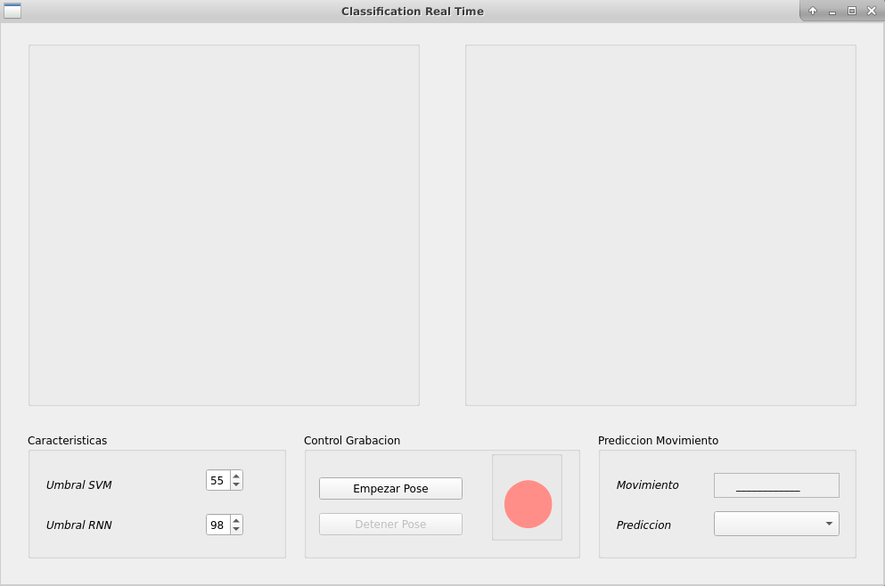
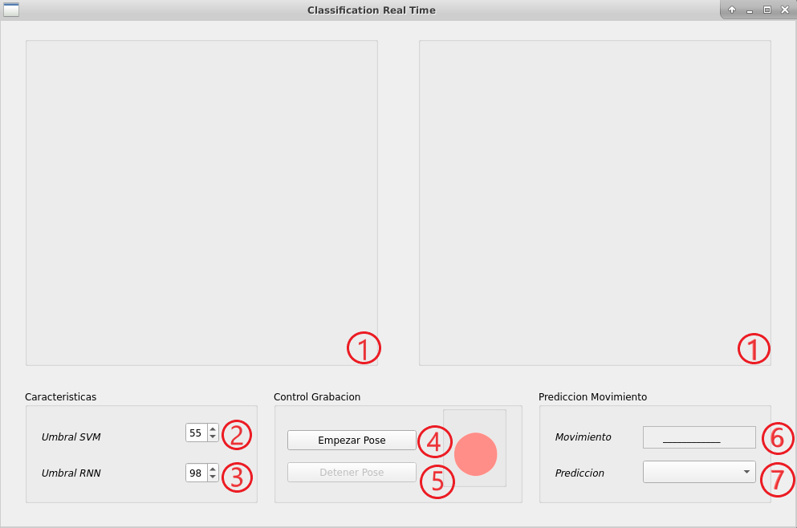

# LSTM and SVM based Movement Recognition

This repository contains the GUI for real time pose estimation. It computes movement prediction using LSTM and SVM

Pose detection is based on the CMU Perceptual Computing Lab's Open Pose, [Code](https://github.com/CMU-Perceptual-Computing-Lab/openpose) and [Paper](https://arxiv.org/pdf/1602.00134.pdf).


## Enviroment installation

Tested with Ubuntu 16.04 and 18.04, cuda 10.0 and anaconda for python 3.7, with a Nvidia RTX 2080 Ti.

You can install the enviroment as follows (it assumes you have nvidia drivers and cuda installed):

``` sh
conda env create -f environment.yml
```

You are to download and save the [OpenPose model](https://drive.google.com/open?id=1Plb4OoTYA7ChHkjCqZeqtC1GvGqWnZdf) in the folder *model*.

## Testing:

``` sh
python Classification_Real_Time_Pose.py
``` 

You should see:



Interface controls description:

- **1.** Real time movement and pose visualization.
- **2.** SVM threshold.
- **3.** RNN threshold.
- **4.** Button to start the visualization of the movement in real time and the pose estimation, the visualization begins after a countdown of 3 seconds.
- **5.** Button to stop the visualization of the movement in real time and the the pose estimation.
- **6.** Movement prediction
- **7.** Learning algorithm selector



Finally, when the prediction algorithm is chosen, if at the time of choosing an algorithm a person is not found, you can see *No Person* in the label, if, on the contrary, a person is found but this person is still, *No predict* will be see how you can predict observe in the following image.


Then when selecting an algorithm and making a move this will be seen in the label, allowing the user to determine if this was correct or not.


